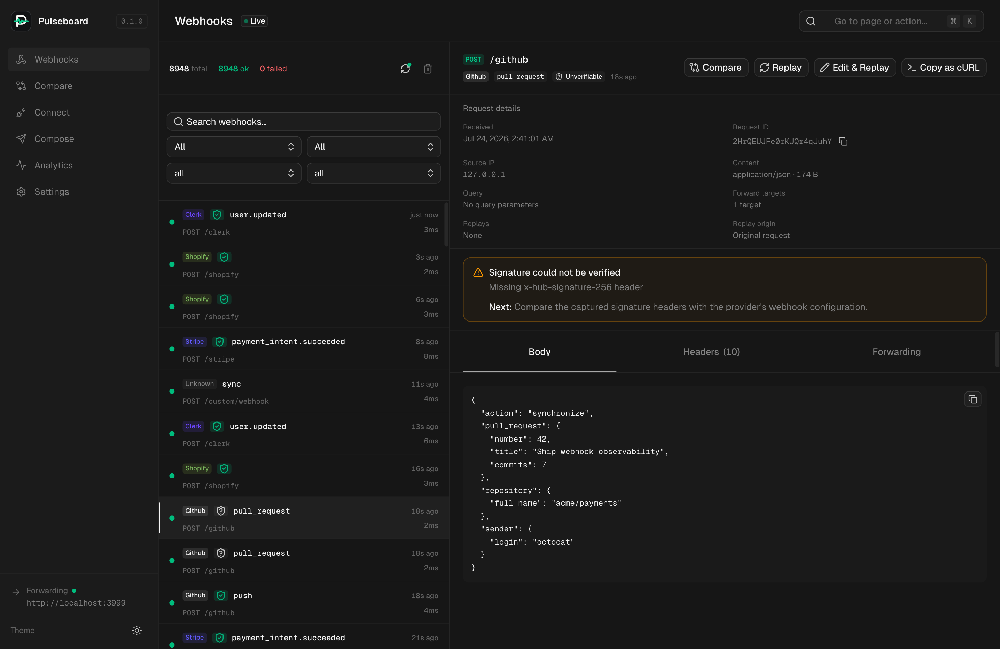
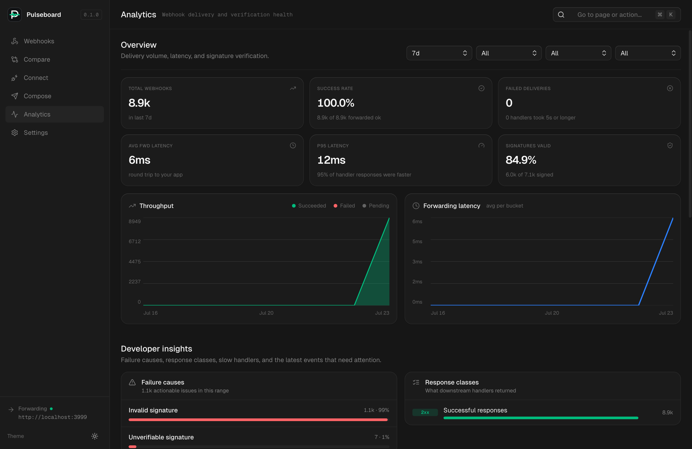
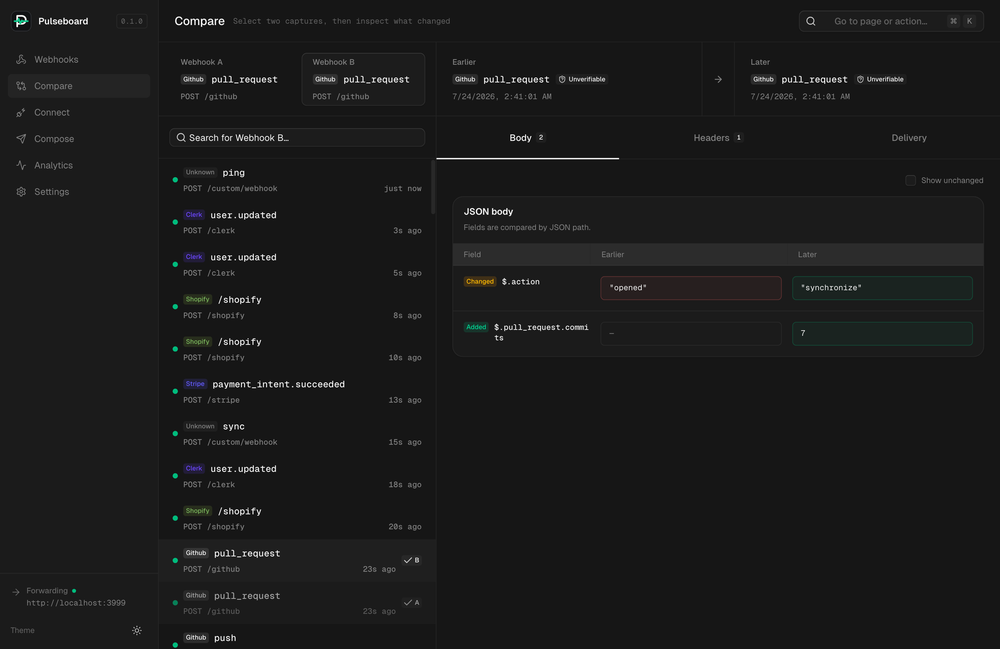

# Pulseboard

Pulseboard is a local-first dashboard for capturing, inspecting, replaying, and forwarding webhooks.

It sits between a webhook provider and your local application:

```text
Provider → your tunnel → Pulseboard :4500/hook/* → your app
```

Pulseboard stores exact request bytes in SQLite, forwards them without re-serialization, detects common providers, verifies signatures, and provides a live web interface.

## Product shots

### Inspect a webhook



### Monitor delivery health



### Compare captures



## Quick start

Requirements: Node.js 20 or newer and pnpm.

```bash
pnpm install
pnpm dev
```

Open [http://localhost:4500](http://localhost:4500). Development mode includes an echo target and generated webhook traffic.

For real use:

```bash
npx @zohaibarsalan/pulseboard --forward http://localhost:3000
```

### Where Pulseboard runs

The npm package starts a local Node.js process on the machine where you run the
command. By default it:

- listens only on `127.0.0.1:4500`;
- serves the dashboard and capture API from that same process;
- stores history in `~/.pulseboard/pulseboard.db`; and
- keeps running in the foreground until you press `Ctrl+C` or terminate it.

`npx` installs the package into npm's cache and launches it; it does not create
a hosted Pulseboard account or permanent cloud server. Running the command
again starts another local process and reuses the same SQLite history unless
you pass a different `--db` path. Only one process can bind to the same port.

To choose explicit runtime locations:

```bash
npx @zohaibarsalan/pulseboard \
  --port 4600 \
  --db ./data/pulseboard.db \
  --forward http://localhost:3000
```

Keep that terminal open while receiving webhooks. Use a tunnel when an external
provider needs to reach the local capture endpoint.

Installing globally changes only how the command is resolved:

```bash
npm install --global @zohaibarsalan/pulseboard
pulseboard --forward http://localhost:3000
```

It still runs locally in the foreground and uses the same default port and
database. For an always-on shared instance, run the Docker image or command
under your own process manager on a server, bind deliberately with
`PULSEBOARD_HOST=0.0.0.0`, and configure authentication before exposing it.

Point your provider or tunnel at:

```text
http://localhost:4500/hook/your-path
```

Pulseboard strips `/hook` before forwarding, so `/hook/stripe` is sent to `http://localhost:3000/stripe`.

### Connect a provider

Open **Connect** in the dashboard to generate a setup for Stripe, GitHub, Shopify,
Vercel, Slack, or a generic HTTP provider. The flow:

- generates the Pulseboard start command for local, Vercel, AWS, Docker, and custom targets;
- generates Stripe CLI, Cloudflare Tunnel, ngrok, or existing-public-URL instructions;
- reports signing-secret and forwarding readiness; and
- sends an inspectable synthetic event through the configured capture and forwarding path.

The synthetic connection test verifies Pulseboard and the configured downstream
target. Send a real provider event afterward to confirm public reachability and
provider signature verification.

### Diagnose deliveries

Pulseboard translates common delivery failures into an explanation and a
concrete next step. It recognizes connection, DNS, TLS, timeout, redirect,
authentication, rate-limit, route, handler, and signature failures while
preserving the raw response and error evidence.

Each forwarding target has a persisted attempt timeline in the webhook
inspector. You can retry only the failed target, inspect every response, and
cancel a queued automatic retry without duplicating the captured webhook.
Automatic retries are disabled by default. Enable them under **Settings →
Delivery retries**, then choose the maximum attempts, initial delay, and delay
cap. Pulseboard retries transient network errors, `408`, `429`, and `5xx`
responses with capped exponential backoff; permanent `4xx` responses remain
manual so a broken request is not hammered repeatedly.

Analytics adds a developer-focused view of delivery health: P95 latency, slow
handler counts, failure causes, response classes, slowest endpoints, recent
events that need attention, first-attempt success, recovered deliveries, and
exhausted retries. Every issue links back to the captured webhook.

### Compare webhook requests

Open **Compare** from the sidebar, or choose **Compare** on a captured webhook
to preload it as Webhook A in the dedicated workspace. The selected pair is kept in the
URL, so the comparison can be bookmarked or shared with someone using the same
Pulseboard instance. A persistent selector lets you switch either side and
search captured events without opening the command palette. The workspace shows:

- added, removed, changed, and unchanged JSON fields by path;
- case-insensitive request-header changes;
- delivery target, status, duration, and signature differences; and
- structured downstream response-body changes.

The comparison is chronological, so the earlier and later values remain clear
even when you start from the older request. Non-JSON payloads fall back to a
whole-body comparison instead of hiding the change.

## Configuration

| Variable | Default | Purpose |
|---|---:|---|
| `PULSEBOARD_HOST` | `127.0.0.1` | Bind host |
| `PULSEBOARD_PORT` | `4500` | Bind port |
| `PULSEBOARD_FORWARD` | — | Default forwarding target |
| `PULSEBOARD_FORWARD_TARGETS` | — | Comma-separated default targets; each capture is sent to all of them |
| `PULSEBOARD_ROUTING_RULES` | `[]` | JSON routing rules matched by `source` and/or `pathPrefix` |
| `PULSEBOARD_ALLOWED_FORWARD_HOSTS` | — | Hostnames allowed for custom Compose/replay targets |
| `PULSEBOARD_FORWARD_TIMEOUT_MS` | `30000` | Forward timeout |
| `PULSEBOARD_DB_PATH` | `~/.pulseboard/pulseboard.db` | SQLite path |
| `PULSEBOARD_READONLY` | `false` | Disable sends, replays, clears, and secret changes |
| `PULSEBOARD_AUTH_PASSWORD` | — | Enable HTTP Basic auth; username is `pulseboard` |
| `PULSEBOARD_REDACT_HEADERS` | sensitive defaults | Comma-separated header-name tokens hidden from clients |
| `PULSEBOARD_RETENTION_DAYS` | `30` | Delete older webhook history |
| `PULSEBOARD_MAX_DB_SIZE_MB` | `1024` | Prune oldest history above this database size |

The `/hook/*` capture endpoint remains unauthenticated when password protection is enabled so providers can deliver webhooks.

### Routing and forwarding safety

Route selected webhooks to one or more services:

```bash
PULSEBOARD_FORWARD_TARGETS=http://localhost:3000,http://localhost:4000 \
PULSEBOARD_ROUTING_RULES='[{"source":"stripe","targets":["http://localhost:3000"]},{"pathPrefix":"/audit","targets":["http://localhost:4000"]}]' \
npx @zohaibarsalan/pulseboard
```

All matching rules are combined and de-duplicated. If no rule matches, the default targets are used. Custom targets entered in Compose or replay must use HTTP(S) and match a configured target origin or a hostname in `PULSEBOARD_ALLOWED_FORWARD_HOSTS`. Redirects are not followed, so an approved endpoint cannot redirect a server-side request to an unapproved host.

Pulseboard records every delivery attempt's target, trigger, state, schedule,
status, duration, error, response headers, and the first 64 KB of its response
body. Configured sensitive header names are redacted from dashboard/API
responses.

## Commands

```bash
pnpm typecheck
pnpm test
pnpm test:e2e
pnpm product-shots
pnpm build
pnpm smoke:package
pnpm smoke:docker
pnpm release:check
pnpm start
```

`pnpm product-shots` starts or reuses the development stack, seeds a
representative GitHub webhook pair, and uses the development-only Screenshotter
integration to capture the webhook inspector, analytics, and comparison
workspaces into `docs/product-shots`. In development, open Screenshotter
manually from its bottom-right launcher or with `Cmd/Ctrl + Shift + K`. It is
excluded from Pulseboard's production bundle and npm runtime.

## Test strategy

Pulseboard uses a risk-based automated release gate. Tests are grouped by
behavior so the suite stays useful and maintainable instead of chasing a test
count. It covers these independent failure boundaries:

- configuration defaults, environment parsing, CLI precedence, invalid values,
  routing rules, forwarding allowlists, and SSRF protections;
- provider detection plus valid, modified, and missing-secret signature cases
  for every signable provider;
- exact-byte capture, authentication, header redaction, capture-only mode,
  read-only mode, persistence, retention, forwarding, response capture,
  retries, delivery diagnostics, and analytics;
- webhook body/header comparison, provider onboarding commands, JSON display,
  time/number formatting, and refresh preferences;
- browser E2E coverage for capture → inspect → edit → replay → compare → clear;
  and
- clean-room npm tarball and Docker smoke tests, including process restart and
  SQLite persistence for the installed package.

Run the fast unit and integration suite with:

```bash
pnpm test
```

Before publishing, run the complete release gate:

```bash
pnpm release:check
```

That command additionally type-checks both server and browser code, audits
production dependencies, executes the real browser workflow, installs the
packed npm artifact in a clean temporary project, and boots the Docker image.
The release is not considered verified if any layer fails.

## Docker

An example is available at `docker/docker-compose.example.yml`.

Keep the dashboard bound to localhost unless authentication is configured and the surrounding network is trusted.
